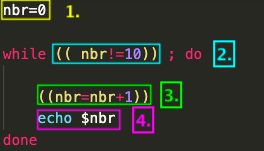
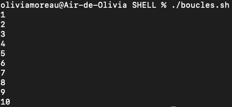
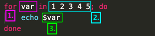
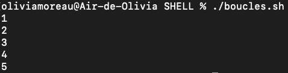

# Les boucles dans un script Shell

Boucler permet de faire une action jusqu'à ce que notre condition soit atteinte, ou pour telle valeur. Pour boucler dans un script Shell, nous avons 2 possibilités. Utiliser le mot clé ` while ` ou le mot clé ` for `. 

## ` while `

` while `correspond à **tant que**. Tant que "le gâteau n'est pas cuit", faire "cuire encore 5 minutes". La forme est similaire aux conditions ` if ` :

    while [ condition ]; do
        action à effectuer
    done
> * ` while ` correspond au TANT QUE
> * ` do ` correspond au ALORS FAIT
> * ` done ` correspond à la fin de la boucle.

**ATTENTION** : Comme pour les conditions ` if `, la condition peut se trouver entre crochets mais aussi entre doubles parenthèses `(( condition/calcul ))`. Je privilégie cette synthaxe car plus simple à utiliser pour faire des calculs.

 

> 1. Initialisation de la variable nbr à 0 
> 2. TANT QUE nbr n'est pas égal à 10, ALORS
> 3. nbr prend la valeur de nbr + 1.
> 4. et on imprime la valeur de nbr.
>> Notre algorithme fait donc ceci : tant que nbr n'est pas égal à 10, alors nbr prend 1 et on affiche nbr, puis on continue la boucle. La boucle s'arrêtera quand nbr aura atteint le nombre 10.

## `for`

`for` correspond à **pour**. Pour un gâteau dans la liste suivante "gâteau au chocolat" "gâteau au yaourt" "gâteau sans beurre", cites-moi chaque gâteau et cuisine le. 

    for var in val1 val2; do
        action
    done
> * ` for ` correspond au POUR
> * `in` correspond au DANS LA LISTE
> * ` do ` correspond au ALORS
> * ` done ` correspond à la fin de la boucle.

 

> 1. POUR la variable var
> 2. Comprise dans la liste suivante
> 3. Alors on affiche var
>> Notre algorithme fait donc ceci : pour la variable var comprise dans la liste 1 2 3 4 5, afficher var. On parcourt toute la liste et on affiche un à un chaque valeur donnée.