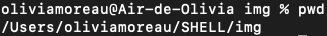
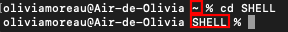
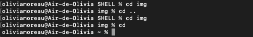
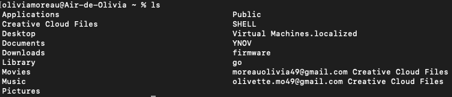

# Les commandes du Shell

Grâce à des commandes saisies dans notre Terminal et à l'interprétation qu'en fera le Shell, il est possible de naviguer dans l'arborescence des fichiers, d'en créer, de créer des utilisateurs, gérer les autorisations, lire le contenu d'un fichier, etc. 

Voici donc des *commandes Shell essentielles*.

## Naviguer entre les fichiers/dossiers

* ### pwd
La commande **pwd** permet d'afficher le répertoire de travail dans lequel on se trouve et l'arborescence de ce dernier.

> Ici, on voit que mon dossier img se trouve dans le dossier SHELL, lui-même se trouvant dans mon dossier utilisateur oliviamoreau, cet utilisateur étant dans le dossier Users.

* ### cd 

La commande **cd** permet de changer de répertoire de travail. 

    cd [nom-répertoire]

Il suffit d'insérer le nom du répertoire dans lequel on veut aller. 

> De mon répertoire principal **oliviamoreau**, j'accède à mon répertoire nommé **SHELL**. On le voit car le tilde est remplacée par le nom de mon répertoire. 
>> Le **tilde** signifie que nous nous trouvons dans le répertoire utilisateur. 

    cd .. 

La commande **cd** suivie de 2 points **..** permet de revenir dans le répertoire précédant sans taper le nom.

    cd

La commande **cd** sans argument derrière permet de revenir au répertoire utilisateur.

> Sur cet exemple, j'accède à mon répertoire **img** grâce à la commande **cd img**. Je reviens ensuite au répertoire contenant le répertoire actif grâce à **cd ..**. Enfin, en utilisant simplement **cd** dans mon répertoire img je reviens dans mon répertoire utilisateur représenté par le tilde.

* ls

    * -a
    * -l
    * -la
* 

