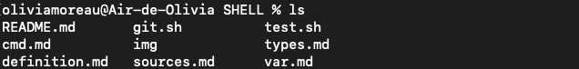

# Les commandes du Shell

Grâce à des commandes saisies dans notre Terminal et à l'interprétation qu'en fera le Shell, il est possible de naviguer dans l'arborescence des fichiers, d'en créer, de créer des utilisateurs, gérer les autorisations, lire le contenu d'un fichier, etc. 

Une commande se présente sous cette forme : *nom-de-la-commande* *arguments*
Les arguments permettent de spécifier l'action demandée.

Voici donc des *commandes Shell essentielles*.

## Naviguer entre les fichiers/dossiers

* ### pwd
La commande **pwd** permet d'afficher le répertoire de travail dans lequel on se trouve et l'arborescence de ce dernier.

> Ici, on voit que mon dossier img se trouve dans le dossier SHELL, lui-même se trouvant dans mon dossier utilisateur oliviamoreau, cet utilisateur étant dans le dossier Users.

* ### cd 

La commande **cd** permet de changer de répertoire de travail. Il suffit d'insérer en argument le nom du répertoire dans lequel on veut aller. 

    cd [nom-répertoire]

> De mon répertoire principal **oliviamoreau**, j'accède à mon répertoire nommé **SHELL**. On le voit car le tilde est remplacée par le nom de mon répertoire. 
>> Le **tilde** signifie que nous nous trouvons dans le répertoire utilisateur. 

    cd .. 

La commande **cd** suivie de 2 points **..** permet de revenir dans le répertoire précédant sans taper le nom.

    cd

La commande **cd** sans arguments derrière permet de revenir au répertoire utilisateur.

> Sur cet exemple, j'accède à mon répertoire **img** grâce à la commande **cd img**. Je reviens ensuite au répertoire contenant le répertoire actif grâce à **cd ..**. Enfin, en utilisant simplement **cd** dans mon répertoire img je reviens dans mon répertoire utilisateur représenté par le tilde.

* ### ls

La commande **ls** permet de voir le contenu du répertoire dans lequel nous nous trouvons. Cette commande peut être spécifiée avec des flags qui permettront de cibler ce que l'on veut afficher.

> L'utilisation de la commande **ls** sur mon répertoire SHELL montre bien le contenu de ce dernier.

    -a
L'argument **-a** sur la commande **ls** permet d'afficher les fichiers cachés du répertoire.

    -l
L'argument **-l** sur la commande **ls** permet d'afficher des informations précises sur le contenu du répertoire comme les permissions, l'utilisateur propriétaire, le groupe de cet utilisateur, la taille du fichier, la date et l'heure de la dernière modification et le nom du fichier.

*On peut aussi regrouper les arguments comme ci-dessous :*

## Créer, modifier, déplacer des fichiers/dossiers

* ### touch
 La commande **touch** permet de créer un fichier.

* ### mkdir
La commande **mkdir** permet de créer un dossier/répertoire.

* ### mv
La commande **mv** permet de déplacer un fichier/répertoire. Pour cela il faut mettre en premier argument l'élément à déplacer et en second le dossier où l'on veut le déplacer. Exemple : 

> Cet exemple nous montre le déplacement du fichier **git.sh** initalement contenu dans le dossier **SHELL** mais qui se retrouve dans le dossier **img**.
>> 
>>Si l'on veut le remettre dans son dossier initial il suffit de revenir dans le répertoire initial et d'insérer un *.* simple en second argument. Cela signifie que l'on déplace le fichier dans le répertoire actif.

* ### rm
* ### cat
* ### cp

