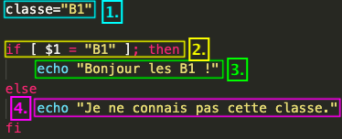
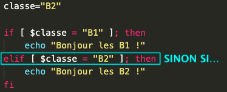
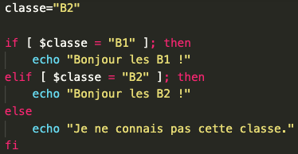
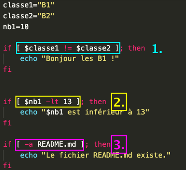
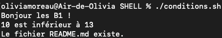

# Les conditions dans un script Shell

On utilise les conditions pour faire une action SI une opération est vérifiée. Pour exemple, SI "Le gâteau est cuit", ALORS "Sors le du four". SINON "Laisse le cuire". Il suffit d'appliquer ce schéma à des variables dans un script Shell ! 

## La forme

Pour écrire une condition on utilise la forme suivante : 

    if [ condition ]; then
        action à effectuer si la condition est vérifié
    else 
        action à effectuer si la condition n'est pas vrai
    fi

> * ` if ` correspond au SI
> * ` then ` correspond au ALORS
> * ` else ` correspond au SINON
> * ` fi  ` correspond à la fin de la condition.

### Exemple IF ELSE

Ce script permet d'imprimer une phrase en fonction du contenu de la variable **classe**.

> 1. J'initialise ma variable **classe** en lui assignant la valeur **B1**
> 2. SI ma variable **classe** est égale à **B1**; alors...
> 3. J'imprime la phrase donnée
> 4. SINON, j'imprime l'autre phrase.
>> **ATTENTION !! Il faut bien mettre des espaces avant les crochets et autour des valeurs à tester lors du test.**

## SINON SI 

On peut aussi vérifier une seconde condition si la première n'est pas vérifiée. Pour cela, on utilise le mot clé **elif** (un condensé de Else If, soit Sinon Si)

### Exemple ELIF

> Notre variable contient **B2**. Le script va vérifier si la variable est égale à **B1**. Si elle n'est pas égale à **B1** mais qu'elle est égale à **B2**, alors on affiche **"Bonjour les B2!"**.

> On peut aussi allier les IF/ELIF et ELSE pour : 
> * Vérifier une *première condition* et faire x action
> * Vérifier une *seconde condition* et faire x action
> * Si *aucune des conditions* n'est vérifiée, faire x action.

## Les conditions à vérifier

On peut appliquer des conditions sur les chaînes de caractères, des nombres et des fichiers. Pour chacun de ces 3 contenus, on utilisera des paramètres spécifiques. Voici la liste : 

### Chaînes de caractères

| Conditions | Significations |
| ----- | ----- |
| ` [ $str1 == $str2 ] ` | *Vérifie si* str1 est **égale** à str2. (Possible avec un seul =) |
| ` [ $str1 != $str2 ] ` | *Vérifie si* str1 n'est pas **égale** à str2 |
| ` [ -z $str ] ` | *Vérifie si* str est **vide** |
| ` [ -n $str ] ` | *Vérifie si* str n'est **pas vide** |

### Fichiers

| Conditions | Significations |
| ----- | ----- |
| ` [ -a fichier ] ` | *Vérifie si* ce fichier **existe** |
| ` [ -d dossier ] ` | *Vérifie si* ce dossier **existe** |
| ` [ -L fichier ] ` | *Vérifie si* ce fichier est un **lien symbolique** |
| ` [ -r fichier ] ` | *Vérifie si* ce fichier est **lisible** |
| ` [ -w fichier ] ` | *Vérifie si* ce fichier est **modifiable** |
| ` [ -x fichier ] ` | *Vérifie si* ce fichier est **exécutable** |
| ` [ fichier1 -nt fichier2 ] ` | *Vérifie si* le fichier 1 est plus **récent** que le fichier 2 (**n**ether**t**han) |
| ` [ fichier1 -ot fichier2 ] ` | *Vérifie si* le fichier 1 est plus **vieux** que le fichier 2 (**o**lder**t**han) |
| ` [ -s fichier ] ` | *Vérifie si* la taille du fichier est **supérieure à zéro** |

### Nombres

| Conditions | Significations |
| ----- | ----- |
| ` [  ] ` | *Vérifie si* |
| ` [ $nb1 -eq $nb2 ] ` | *Vérifie si* les nombres son égaux |
| ` [ $nb1 -ne $nb2 ] ` | *Vérifie si* les nombres ne sont pas égaux |
| ` [ $nb1 -lt $nb2 ] ` | *Vérifie si* ` nb1 ` est **inférieur** à ` nb2 `|
| ` [ $nb1 -le $nb2 ] ` | *Vérifie si* ` nb1 ` est **inférieur ou égal** à ` nb2 `|
| ` [ $nb1 -gt $nb2 ] ` | *Vérifie si* ` nb1 ` est **supérieur** à ` nb2 `|
| ` [ $nb1 -ge $nb2 ] ` | *Vérifie si* ` nb1 ` est **supérieur ou égal** à ` nb2 `|

### Exemples des conditions

 

> 1. Condition sur deux chaînes de caractères 
> 2. Condition sur un nombre
> 3. Condition sur un fichier

*[Retour au sommaire](./README.md)* | 
*[Sources](./sources.md)* | *[Chapitre suivant (Les boucles](./boucles.md)*

