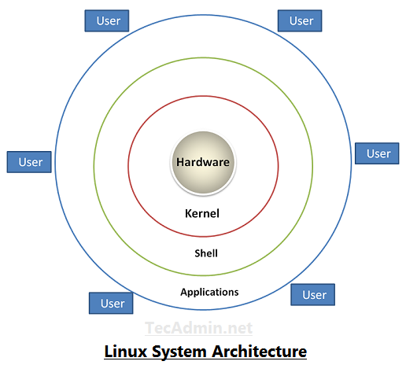

# Définitions

## <u>Le système d'exploitation : OS<u>

*Avant de définir le Shell, je souhaite comprendre la notion de système d'exploitation pour bien comprendre l'utilisation du Shell*

Le **système d'exploitation** (ou Operating System / OS / logiciel système) est le **programme de base qui pilote les différents composants de l'appareil informatique et reçoit des instructions de l'utilisateur ou d'autres logiciels**. Il assure le lien entre les **ressources matérielles** de la machine (HardWare) et les **applications** (SoftWare).

Le système d'exploitation est le **premier programme exécuté** par la machine au démarrage car il précise les tâches à effectuer. Dès que la machine a bien exécuté les commandes initiales du logiciel système, ce dernier laissera la main à l'utilisateur pour **exécuter d'autres commandes**. L'utilisateur utilisera les application, l'interface graphique ou une invite de commandes pour demander l'exécution d'une tâche par l'OS.

### Les composants d'un OS
* Le **KERNEL**
    * Noyau de l'OS
    * Gère les fonctions clés de l'OS
    * Permet la communication directe avec les ressources matérielles
    * Interface entre le logiciel et le matériel de l'ordinateur

* Le **SHELL**
    * *Coquille* de l'OS
    * Interpréteur de commandes
    * Permet de communiquer avec l'OS par l'intermédiaire d'un langage de commandes

* Le **FILE SYSTEM**
    * Système de fichiers
    * gère l'arborescence, l'écriture et la lecture des fichiers
    * Enregistrer les fichiers ans une arborescence

* Les **DRIVERS**
    * Correspondent aux pilotes
    * Permettent la gestion des périphériques

> Pour résumer : Le **système d'exploitation** est un programme système qui fait le lien entre les composants de la machine, les applications et les demandes de l'utilisateur. Il est principalement composé d'un noyau appelé **Kernel** et d'une coquille appelée **Shell**.

---------------------

## La coquille du système d'exploitation : le **SHELL**

Le Shell est un **programme qui interprète les commandes** données par l'utilisateur **et les exécute** en les transmettant au système d'exploitation. Les commandes sont saisies dans la **console** ou un **Terminal**, qui sont tous deux des invites de commande. On travaille donc sur l'*interface console*, contrairement à l'*interface graphique* où l'on navigue dans la machine grâce à la souris et/ou au clavier avec des icônes visuelles assez intuitives. Ici, ce sont les commandes soumises par l'utilisateur via son clavier et interprétées par le Shell qui permettront d'**exécuter une ou plusieurs actions** sur notre machine. 

On retrouve les commandes Shell dans le répertoire */bin* de notre machine. 

**Le Shell permet :**
* D'exécuter les commandes
* D'explorer l'arborescence d'un système
* De créee, d'éditer et de supprimer des fichiers

Une des autres fonctionnalités importantes du Shell se trouve dans la **création de scripts Shell** qui permettent d'**automatiser** des actions que nous pourrions réaliser une à une à la main. (*Voir [Les Scripts Shell](./scripts.md)*)

*[Retour au sommaire](./README.md)* | 
*[Sources](./sources.md)* | *[Chapitre suivant (Types de Shell)](./types.md)*