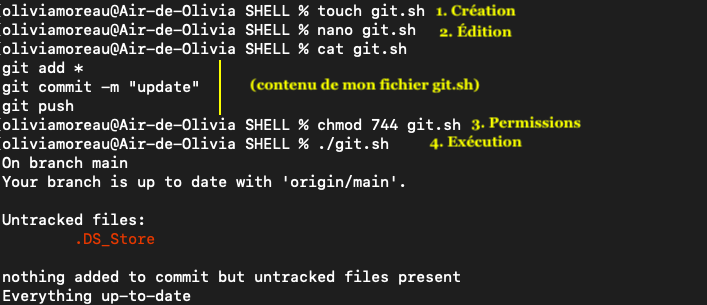

# Les Scripts SHELL

Shell est un interpréteur de commandes mais a aussi son propre langage de programmation. On peut donc coder en Shell un programme qui permet d'exécuter des actions sur le système. Pour cela, il suffit de : 

* Créer un fichier avec l'extension .sh
* Lui donner les autorisations d'exécution avec *chmod 744 fichier.sh*
* L'exécuter en inscrivant dans le terminal *./fichier.sh*

Le script contenu dans le fichier va donc s'exécuter. Les commandes inscrites dans le script seront lues et exécutées lignes par lignes. Ce script permet de gérer des variables grâce à des conditions, des boucles, des opérations sur les variables etc. 

## Premier script Shell : git.sh

Pour illustrer la création d'un script, j'ai créé un script permettant d'ajouter les modifications effectuées sur mes fichiers directement sur mon GitHub, action qui demande 3 commandes.

> 1. Création du fichier **git.sh**
> 2. Édition du fichier avec les lignes de commandes utiles à l'exécution de l'action
> 3. Permissions données au fichier
> 4. Exécution du script

Les 3 commandes inscrites dans mon script git sont les suivantes : 
* **git add *** 
    * git add permet d'ajouter le changement d'un fichier à notre git
    * l'étoile correspond à l'ensemble des fichiers dans le répertoire où le script est exécuté
* git commit -m "update"
    * git commit permet de commiter les modifications, soit de créer une nouvelle version du fichier mis à jour
    * -m permet d'ajouter un message de commit
    * par défaut, et pour gagner du temps, j'ai appelé mon message de commit "update"
* git push
    * git push permet de charger le contenu ajouté de notre machine au serveur du GitHub de destination. 

