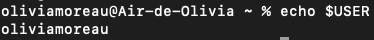
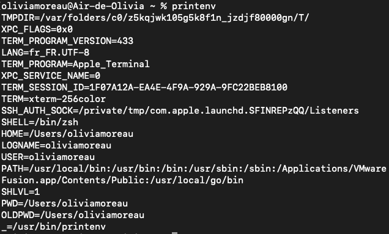
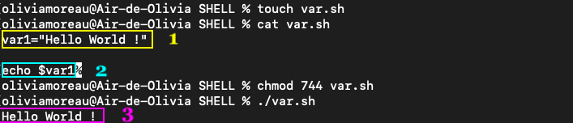

# LES VARIABLES D'ENVIRONNEMENT

Une variable d'environnement est une donnée du système que l'on peut récupérer à n'importe quel moment dans nos scripts Shell. On peut comparer ce type de variable à une variable globale initialisée au début du script et récupérable du début à la fin dans ce script.

## Liste des variables d'environnement

* USER : Nom de l'utilisateur
* PATH : chemin d'accès au fichier bin qui contient le Shell
* LOGNAME : Nom de l'utilisateur connecté
* HOME : Répertoire home
* SHELL : Type de Shell utilisé
* PWD : Répertoire et chemin d'accès dans lequel on se trouve
* TERM_PROGRAM : Programme utilisé pour gérer le terminal
* TERM_PROGRAM_VERSION : La version du programme en question
* LANG : Langue utilisée avec son encodage
* _ : chemin d'accès à la commande printenv

## Commandes utiles pour ces variables

* printenv : Affiche les variables d'environnement actives
* echo $VAR : Affiche le contenu de la variable d'environnement 
* set (liste des variables paramétrées)
* env : variables exportées d'office 

On utilise **$** pour sélectionner les variables

>"Un shell conserve un environnement qui inclut un ensemble de variables définies par le programme login, le fichier d'initialisation système et les fichiers d'initialisation utilisateur. En outre, certaines variables sont définies par défaut." [Guide d'administration système : administration de base | Oracle](https://docs.oracle.com/cd/E24843_01/html/E23288/userconcept-23295.html)

## Exemples

> Avec la commande **echo** j'ai demandé au Shell de m'imprimer le nom de l'utilisateur actif. 

> Avec la commande **printenv** j'ai affiché la liste des variables d'environnement actives.

## Utilisation des variables dans un script Shell

> 1. Je crée la variable **var1** et lui donne une valeur **"Hello World !"**. Cette variable contient donc la valeur attribuée.
> 2. J'utilise la commande **echo** pour imprimer le contenu de ma variable **var1**. Pour cela, je mets le signe **$** devant la variable pour l'appeler.
> 3. Lors de l'exécution du script, la variable est créée et le script renvoie bien le contenu de cette dernière.

*[Retour au sommaire](./README.md)* | 
*[Sources](./sources.md)* | *[Chapitre suivant (Les conditions)](./conditions.md)*